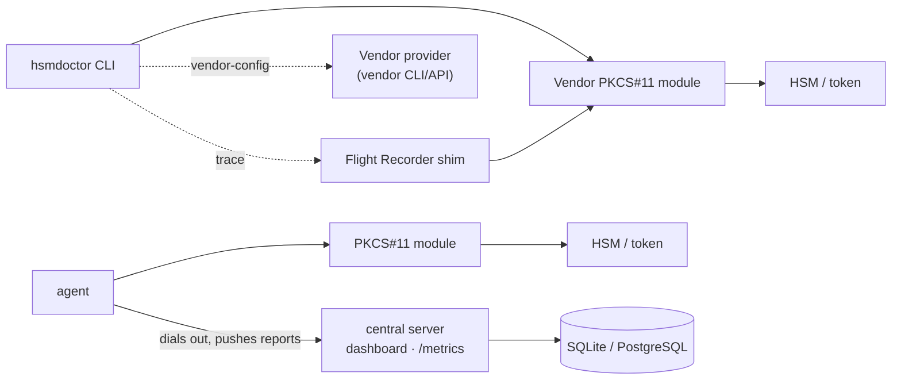
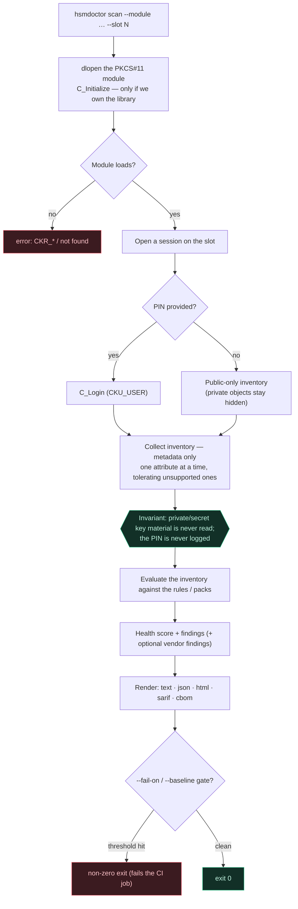
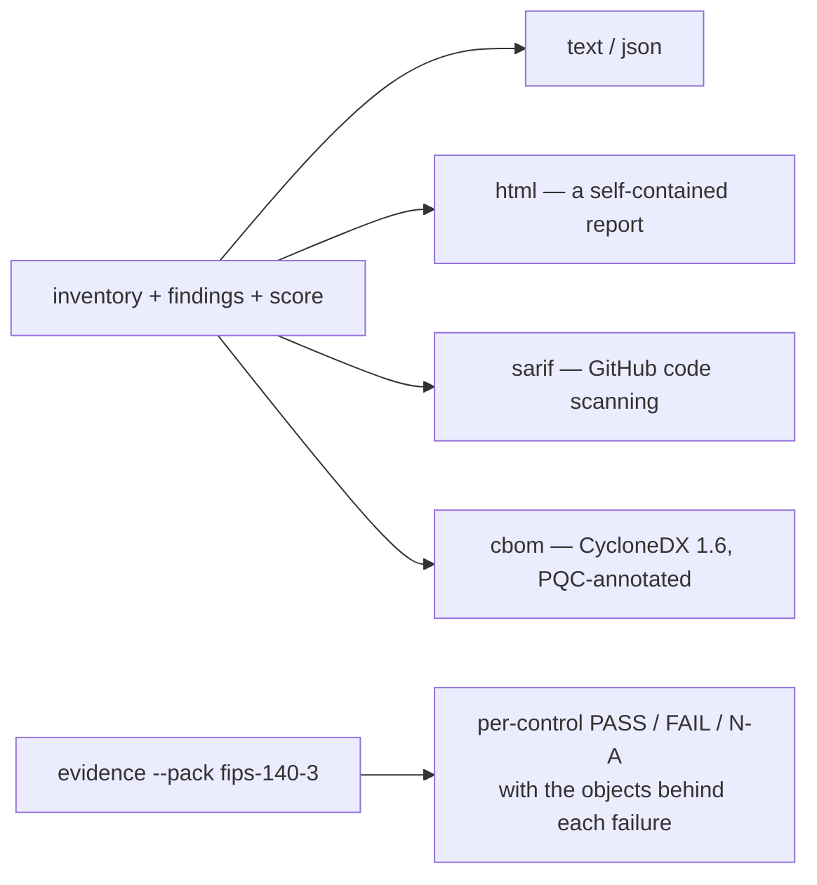
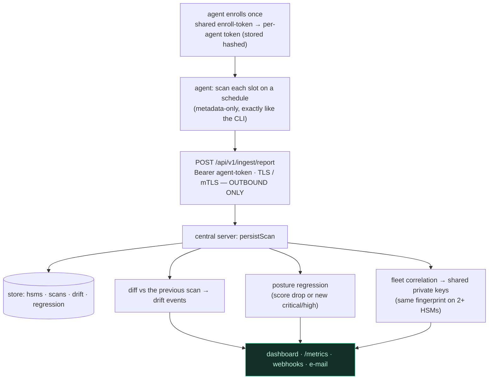
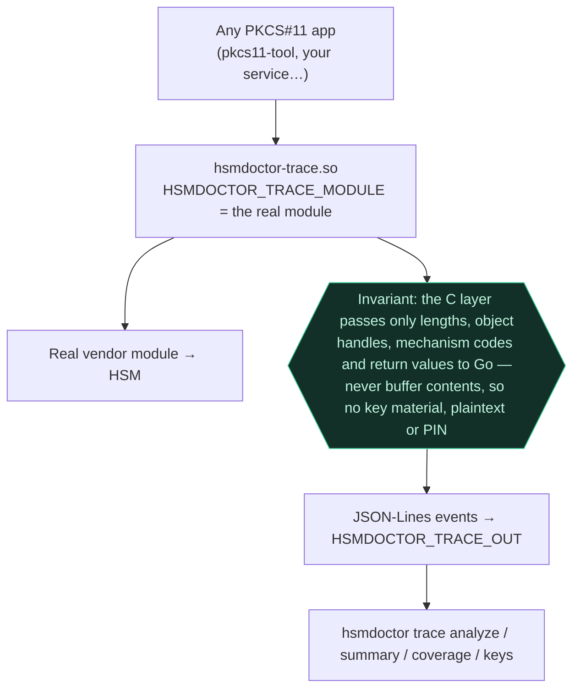

# How HSM Doctor works

A plain walkthrough: first how the pieces fit together, then the exact path a
single scan takes — from a command on your workstation down to the token and
back out as a report — and every invariant it holds on the way. After that, the
fleet data path, the Flight Recorder, and how findings become reports.

HSM Doctor inspects the health and security posture of Hardware Security
Modules through the standard **PKCS#11** interface — reading only public
metadata, never the key material — and turns what it finds into scores,
findings, machine-readable reports and fleet-wide signals.

## The pieces

Everything is one static binary (`hsmdoctor`) that plays a few different roles.
There is no service to keep running for the basics; the fleet parts are opt-in.

| Piece | Where it runs | What it is |
|---|---|---|
| **CLI** | your workstation or CI | The tool itself: `scan`, `certs`, `pqc`, `test`, `bench`, `evidence`, `preflight`, `trace`, … Talks to a token through a PKCS#11 module. |
| **PKCS#11 module** | wherever the HSM client lives | The vendor's `.so`/`.dll`. HSM Doctor loads it, never replaces it. |
| **Flight Recorder shim** | in front of the module (optional) | A drop-in wrapper that records a **secret-safe** trace of PKCS#11 calls. |
| **Vendor provider** | same host (optional) | Reads appliance-level health (HA, tamper, disk) via the vendor's own CLI/API and folds it into the score. |
| **Agent** | inside your network (fleet, optional) | Scans on a schedule and **dials out** to push reports. No inbound port. |
| **Central server** | your cloud/DC (fleet, optional) | Stores history, detects drift/regression/shared keys, serves a dashboard, `/metrics`, webhooks and e-mail. |

## The journey of a single scan

**Scenario:** you run `hsmdoctor scan --module /usr/lib/pkcs11.so --slot 3
--pin-env PIN --pack fips-140-3`. Every scan travels this path. A branch
labelled *no* is where the request stops; the hexagon is an invariant that
holds no matter what.

Step by step:

1. **Load the module.** HSM Doctor `dlopen`s the vendor library you named and
   calls `C_Initialize` — but only if it was the one to load it. If the library
   was already initialized by the host process, HSM Doctor **does not** finalize
   it on exit (finalizing a library you don't own would tear down the owner's
   sessions).
2. **Open a session** on the target slot. The slot comes from `--slot`, or is
   matched from an RFC 7512 `pkcs11:` URI.
3. **Log in — or don't.** With a PIN (`--pin-env` is preferred; the PIN is read
   from the environment, never echoed and never logged) it performs a `CKU_USER`
   login. Without one, the scan proceeds **public-only**: most tokens hide
   private objects from an anonymous session, so the inventory is honestly
   incomplete rather than silently wrong.
4. **Collect the inventory — metadata only.** Attributes are fetched **one at a
   time**, because some tokens fail a whole batch when any single attribute is
   unsupported; unsupported attributes are treated as "not exposed", not as
   errors. Key **sizes** and **fingerprints** come from public material only —
   an RSA modulus, an EC point — so a fingerprint can correlate a key with its
   certificate **without ever reading the private key**.
5. **The invariant.** No private or secret key material ever leaves the HSM, and
   the PIN never reaches a log or a report. This is the whole safety story of a
   scan, and it holds on every path above.
6. **Evaluate.** The inventory is checked against the active rules — the
   `default` set, or the packs you named (`nist`, `cabf`, `strict`,
   `fips-140-3`, …). Each match is a finding with a severity and a fix.
7. **Score and, optionally, fold in the appliance.** The health score starts at
   100 and each finding subtracts its severity's penalty (floor 0). With
   `--vendor-config`, appliance findings (HA down, tamper, disk) join the same
   scoring.
8. **Render.** The same result becomes `text`, `json`, a single-file `html`
   report, `sarif` (for code-scanning dashboards) or `cbom` (a CycloneDX 1.6
   Cryptographic Bill of Materials).
9. **The CI gate.** `--fail-on high` exits non-zero when a finding at or above a
   severity exists; `--baseline saved.json` exits non-zero on a **posture
   regression** versus a saved report. Either turns a scan into a build gate —
   without a database.

## Findings become reports

One scan result feeds every output format; nothing is re-collected.

`hsmdoctor evidence --pack fips-140-3` reframes the same rules as an
**auditor-facing** report: every rule becomes a control marked **pass**,
**fail** or **not-applicable** (the token holds no object of the kind the
control checks), with the offending objects listed under each failure. A
control fails exactly when a `scan` with that pack produces a finding for its
rule, so the two views never disagree.

## The fleet data path

When you run more than a handful of HSMs, the **agent** and **central server**
turn one-off scans into a monitored fleet. The direction of travel matters: the
agent always **dials out**; the server never reaches into your network.

Step by step:

1. **Enroll once.** An agent presents a shared enrollment token and receives its
   own per-agent token; the server stores only a SHA-256 **hash** of it.
2. **Scan and push.** On its schedule the agent scans each initialized slot —
   the same metadata-only collection as the CLI — and pushes the report
   outbound over TLS (optionally mutual TLS). The server keeps no inbound path
   into your network.
3. **Persist and analyse.** The server stores each report and, comparing it with
   the previous one, records **drift** (objects, attributes, mechanisms,
   firmware) and a **posture regression** when the score drops or a new
   critical/high finding appears.
4. **Correlate across the fleet.** It flags a **shared private key** — the same
   public-key fingerprint present on more than one HSM, a sign the key material
   was copied out of hardware. Public metadata only; no key material is read.
5. **Surface it.** Everything shows up on the web dashboard, as Prometheus
   metrics at `/metrics`, and as webhook and e-mail notifications. Access is
   gated by bearer tokens or OIDC/SSO.

## The Flight Recorder

To see what an application actually *does* with a token, drop the shim in front
of the real module. It is a diagnostic tap, and it is **secret-safe by
construction**.

The app loads the shim instead of the real library; the shim forwards every
call to the real module (named by `HSMDOCTOR_TRACE_MODULE`) so behaviour is
unchanged, and emits one JSON-Lines event per instrumented call. Because the C
layer never hands buffer contents to Go — only metadata — a trace can be
shared without leaking secrets. Then `hsmdoctor trace` inspects it for
session/operation leaks, ordering bugs, errors and slow calls, reports which
functions were exercised (`coverage`), or reconstructs per-key usage and
**idle keys** (`keys`).

## What keeps it trustworthy

The same thread runs through every path above:

- **Metadata only.** Private and secret key material is never read; the scan
  works entirely from public attributes and public-key material.
- **The PIN is never logged** — not in output, reports, traces or the fleet
  database (where DSN passwords are redacted too).
- **Functional tests leave nothing behind.** `hsmdoctor test` uses ephemeral
  session objects and destroys everything it creates.
- **Traces carry no secrets** — enforced in the C layer, not by a flag.
- **The outbound-only agent** means the fleet server never dials into your
  network.
- **An audit trail by design.** Drift and regression events form a history of
  how a token's posture changed over time — the record that backs the
  compliance story (with the `fips-140-3` / `pci-hsm` / `cnsa-2.0` packs and
  `evidence` reports on top).
- **A signed supply chain.** Releases ship a CycloneDX SBOM and keyless
  **cosign** signatures; verify downloads against the signed `SHA256SUMS.txt`.

## See also

- [cli.md](cli.md) — every command and flag
- [rules.md](rules.md) — rules, conditions and policy packs
- [vendors.md](vendors.md) — vendor providers and how to write one
- [trace.md](trace.md) — building and using the Flight Recorder
- [deployment.md](deployment.md) — running the fleet server and agents
- [architecture.md](architecture.md) — the static package layout
- [compatibility.md](compatibility.md) — what is stable, and what is experimental
